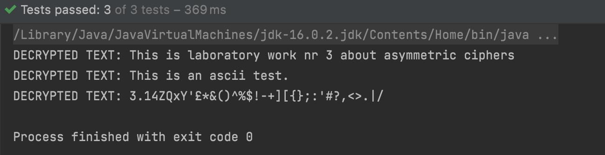

# Lab Nr. 3: Asymmetric Ciphers.

---
## Table of Contents

* [Theory](#theory)
* [Objectives](#objectives)
* [RSA Algorithm](#rsa-algorithm)
* [RSA Implementation](#rsa-implementation)
* [Output](#output)
* [Conclusions](#conclusions)

## Theory

&ensp;&ensp;&ensp; Asymmetric Cryptography (a.k.a. Public-Key Cryptography) deals with the encryption of plain text when having 2 keys, one being public and the other one private. The keys form a pair and despite being different they are related.

&ensp;&ensp;&ensp; As the name implies, the public key is available to the public but the private one is available only to the authenticated recipients.

&ensp;&ensp;&ensp; A popular use case of the asymmetric encryption is in SSL/TLS certificates along side symmetric encryption mechanisms. It is necessary to use both types of encryption because asymmetric ciphers are computationally expensive, so these are usually used for the communication initiation and key exchange, or sometimes called handshake. The messages after that are encrypted with symmetric ciphers.


**Examples**
1. RSA
2. Diffie-Helman
3. ECC
4. El Gamal
5. DSA


## Objectives
1. Get familiar with the asymmetric cryptography mechanisms.

2. Implement an example of an asymmetric cipher.

3. As in the previous task, use a client class or test classes to showcase the execution of the programs.

## RSA Algorithm
The RSA algorithm creates a pair of “commutative” keys – two keys which allow you to “encrypt with one key, and decrypt with the other.”


The term “key” here simply means a numerical value. And the terms “encrypt” and “decrypt” simply represent an arithmetic formula.

What makes the keys “commutative” is that it works in either direction. Notice here, the Plaintext is encrypted with Key 2, and decrypted with Key 1.


The general strategy is to keep one of those keys to yourself and never share it. And give the other key out freely.

The key you give out freely, the Public Key, can be used by anyone to encrypt messages that only you can decrypt with the correlating key which you kept as your Private Key.

Of course, there are performance drawbacks for encrypting and decrypting with RSA keys, but those are negligible if the content you are encrypting and decrypting is small enough.

Apart from the evident use case of exchanging a (small) secret message, RSA can be used to **generate Signatures** and **exchange Secret Keys**.

## RSA Implementation

**Encryption:**

Encrypts plaintext passed as argument into ciphertext using RSA.

```
@Override
public void encrypt(String message) {
    if (this.isECoPrime()) {
        if (message.length() > 0) {
            cipherText = new BigInteger[message.length()];
            String ascii = stringToAscii(message);

            if (ascii != null) {
                Scanner scanner = new Scanner(ascii);
                int counter = 0;
                while (scanner.hasNext()) {
                    int character = Integer.parseInt(scanner.next());
                    cipherText[counter] = encrypt(character);
                    counter++;
                }
            }
        }
    }
}
```

Encrypts an ascii code by applying **A^e mod(n)**, where **A = ascii code**, **e = public key**, and **n = p * q**.
It takes as a parameter the ascii code to be encrypted and returns an encrypted ascii code as a BigInteger value.

```
private BigInteger encrypt(int asciiCode) {
    BigInteger bigAscii = BigInteger.valueOf(asciiCode);
    return bigAscii.modPow(publicKey.get("e"), publicKey.get("n")); // returns c = M^e mod(n)
}
```

**Decryption:**

Decrypts cipher text - **c**, back to plain text - **m**, using private key - **d**, via **m = c^d mod(n)**.

```
@Override
public String decrypt() {
    StringBuilder plainText = new StringBuilder();
    if (cipherText != null) {
        BigInteger d = privateKey.get("d");
        for (BigInteger cipherValue : cipherText) {
            char character =  (char) cipherValue.modPow(d, n).intValue(); // m = c^d mod(n)
            plainText.append(character);

        }
        System.out.println("DECRYPTED TEXT: " + plainText);
        return plainText.toString();
    }
    return null;
}
```

Determines whether the Greatest Common Divisor of totient Q(n) and e equals 1 (whether they are co-prime).

```
public boolean isECoPrime() {
    return totient.gcd(n).equals(BigInteger.ONE);
}
```

Converts a string to its ascii code representation.

```
public static String stringToAscii(String message) {
    if (message.length() > 0) {
        StringBuilder asciiFormat = new StringBuilder();
        for (int i = 0; i < message.length(); i++) {
            if (i < message.length() - 1) {
                asciiFormat.append((int) message.charAt(i)).append(" ");
            } else {
                asciiFormat.append((int) message.charAt(i));
            }
        }
        return asciiFormat.toString();
    }
    return null;
}
```

## Output



## Conclusions
&ensp;&ensp;&ensp; To summarise, in this laboratory work I learned what asymmetric ciphers are and how are they different from symmetric ones. I have analysed and implemented the RSA algorithm which is one of the three pillars of Asymmetric Encryption, together with Diffie-Hellman and DSA algorithms.

&ensp;&ensp;&ensp; RSA (Rivest–Shamir–Adleman) is a public-key cryptosystem that is widely used for secure data transmission. It is also one of the oldest. The acronym "RSA" comes from the surnames of Ron Rivest, Adi Shamir and Leonard Adleman, who publicly described the algorithm in 1977.