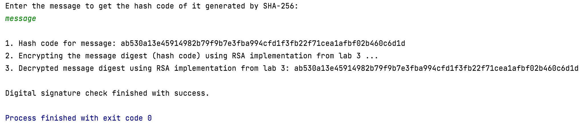

# Lab Nr. 4: Hash functions and Digital Signatures.

---
## Table of Contents

* [Theory](#theory)
* [Objectives](#objectives)
* [Implementation Description](#implementation-description)
* [Output](#output)
* [Conclusion](#conclusion)

## Theory

&ensp;&ensp;&ensp; Hashing is a technique used to compute a new representation of an existing value, message or any piece of text. The new representation is also commonly called a digest of the initial text, and it is a one way function meaning that it should be impossible to retrieve the initial content from the digest.

&ensp;&ensp;&ensp; Such a technique has the following usages:
* Offering confidentiality when storing passwords,
* Checking for integrity for some downloaded files or content,
* Creation of digital signatures, which provides integrity and non-repudiation.

&ensp;&ensp;&ensp; In order to create digital signatures, the initial message or text needs to be hashed to get the digest. After that, the digest is to be encrypted using a public key encryption cipher. Having this, the obtained digital signature can be decrypted with the public key and the hash can be compared with an additional hash computed from the received message to check the integrity of it.


**Examples:**
1. Argon2
2. BCrypt
3. MD5 (Deprecated due to collisions)
4. RipeMD
5. SHA256 (And other variations of SHA)
6. Whirlpool


## Objectives
1. Get familiar with the hashing techniques/algorithms.
2. Use an appropriate hashing algorithms to store passwords in a local DB.
   1. You can use already implemented algortihms from libraries provided for your language.
   2. The DB choise is up to you, but it can be something simple, like an in memory one.
3. Use an asymmetric cipher to implement a digital signature process for a user message.
    1. Take the user input message.
    2. Preprocess the message, if needed.
    3. Get a digest of it via hashing.
    4. Encrypt it with the chosen cipher.
    5. Perform a digital signature check by comparing the hash of the message with the decrypted one.

## Implementation Description
To calculate cryptographic hashing value, **MessageDigest** class is used, under the package java.security.

MessageDigest class provides the following cryptographic hash functions to find the hash value of a text:
1. MD5
2. SHA-1
3. SHA-256

These algorithms are initialized in the static method called **getInstance()**: ```MessageDigest.getInstance("SHA-256")```. After selecting the algorithm it calculates the **digest value** and returns the result in byte array: ```return messageDigest.digest(input.getBytes(StandardCharsets.UTF_8));```.

```
public static byte[] getSHA(String input) throws NoSuchAlgorithmException {
     MessageDigest messageDigest = MessageDigest.getInstance("SHA-256");
     return messageDigest.digest(input.getBytes(StandardCharsets.UTF_8));
 }
```

**BigInteger** class is used, which converts the resultant byte array into its sign-magnitude representation. This representation is converted into hex format to get the MessageDigest.

```
public static String toHexString(byte[] hash) {
     BigInteger number = new BigInteger(1, hash);

     StringBuilder hexString = new StringBuilder(number.toString(16));

     while (hexString.length() < 64) {
         hexString.insert(0, '0');
     }

     return hexString.toString();
 }
```
The **encryption** and **decryption** of the message digests are being performed with the help of the RSA algorithm implemented previously in lab 3.
```
public static String encryptMessageDigest(String messageDigest) {
     RSA rsa = new RSA(1024);
     return rsa.encrypt(messageDigest);
 }

 public static String decryptMessageDigest(StringBuilder encryptedMessageDigest) {
     RSA rsa = new RSA(1024);
     return rsa.decrypt(encryptedMessageDigest);
 }
```
Lastly, a **digital signature check** of the generated message hash and the decrypted message is being performed.
```
public static void digitalSignatureCheck(String messageDigest, String decryptedMessage) {
     if (Objects.equals(messageDigest, decryptedMessage)) {
         System.out.println("\nDigital signature check finished with success.");
     } else {
         System.out.println("\nDigital signature check failed. " +
                 "The hash of the message and the decrypted one aren't equal.");
     }
 }
```


## Output



## Conclusion
&ensp;&ensp;&ensp; To summarise, in this laboratory work I became familiar with various hashing techniques and algorithms by implementing a digital signature process for a user message.

&ensp;&ensp;&ensp; Firstly, I took the message input from user, then I got a digest of it using the SHA-256 algorithm from the MessageDigest class under java.security package. After that I encrypted it using RSA implementation from previous laboratory work and finally, I performed a digital signature check by comparing the message digest with the decrypted one.

&ensp;&ensp;&ensp; Hashing is a key way you can ensure important data, including passwords, isn't stolen by someone with the means to do you harm. Hashing algorithms can be used for: password storage, digital signatures, document management, file management.